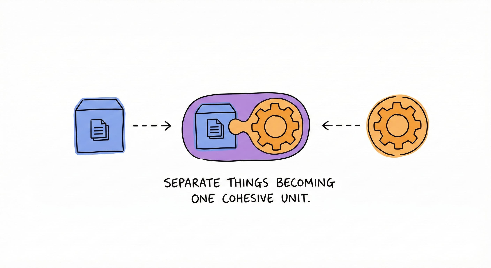
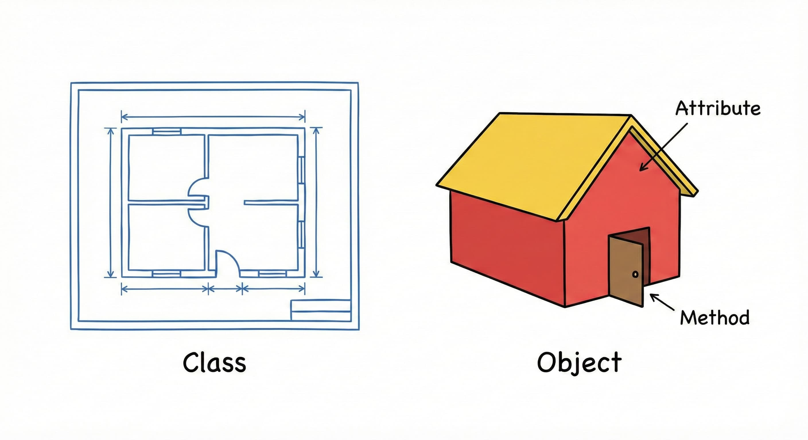
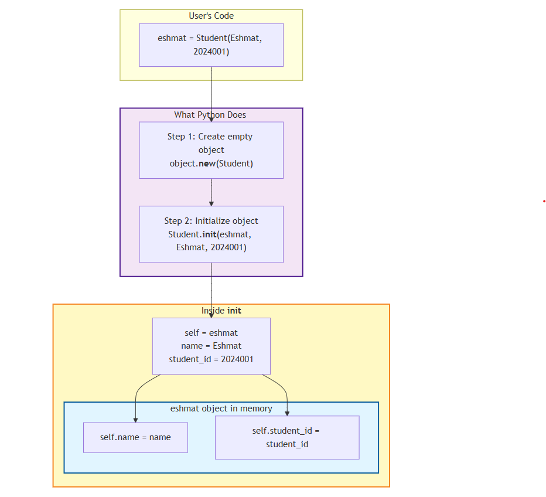
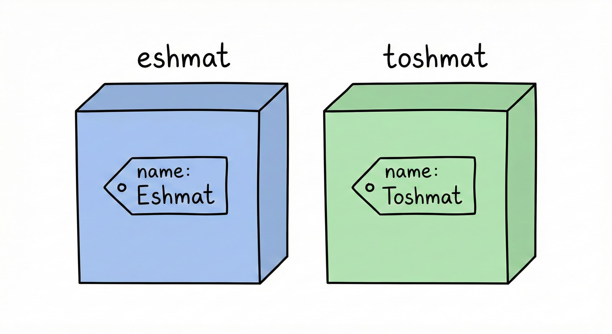
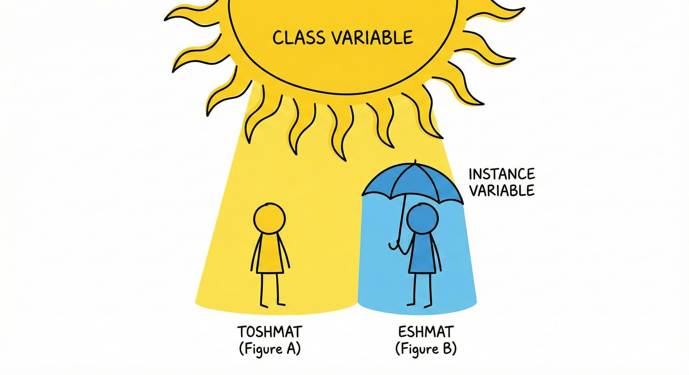

Week 1 Lecture: Object-Oriented Programming in Python

Object-Oriented Programming (OOP) is a programming paradigm where “objects” contain data (attributes) and code (methods). It allows developers to model software after real-world entities.
--------------------------------------------------------------------------------
1. Limitations of Procedural Programming
To understand OOP, we first examine procedural programming limitations. In this paradigm, programs are organized as sequences of steps with variables and functions operating on data.

Example: Student management system using procedural approach:

```
student1_name = "Eshmat"
student1_id = "2024001"
student1_grades = [85, 90, 78]

student2_name = "Toshmat"
student2_id = "2024002"
student2_grades = [92, 88, 95]

def calculate_average(grades):
    return sum(grades) / len(grades)

def display_student(name, student_id, grades):
    avg = calculate_average(grades)
    print(f"Student: {name}, ID: {student_id}, Average: {avg}")

display_student(student1_name, student1_id, student1_grades)
display_student(student2_name, student2_id, student2_grades)
```

This approach works for small scripts but becomes unmanageable as complexity grows. Managing hundreds of students creates disconnected variables.

The Dictionary Approach
Dictionaries can group related data:
```
student1 = {
    "name": "Eshmat",
    "id": "2024001",
    "grades": [85, 90, 78]
}

student2 = {
    "name": "Toshmat",
    "id": "2024002",
    "grades": [92, 88, 95]
}

def calculate_average(student):
    return sum(student["grades"]) / len(student["grades"])

def display_student(student):
    avg = calculate_average(student)
    print(f"Student: {student['name']}, ID: {student['id']}, Average: {avg}")

display_student(student1)
display_student(student2)
```
However, data and functions remain separate. This introduces risks:

Data Integrity: Dictionaries don’t enforce structure (e.g., missing keys, typos).
Error Handling: Structural errors cause runtime KeyError exceptions.
Validation: No centralized validation (e.g., grades 0–100 range).
The fundamental question OOP answers is: How can data and the functions that operate on that data exist as a single unit?


--------------------------------------------------------------------------------
2. Core Concepts of OOP
OOP combines data (attributes) and behavior (methods) into a single entity called an object—this is encapsulation.

Real-World Modeling
OOP models real-world objects. For example, an automobile has:

Properties: Color, brand, speed, fuel level.
Behaviors: Acceleration, braking, turning.
In OOP, these are bundled together.

Key Terminology
Class: Blueprint/template defining object structure (properties and behaviors).
Object: Instance created from a class with concrete values.
Attribute: Variable associated with an object (data).
Method: Function associated with an object (behavior).
The Blueprint Analogy
A class is like a house blueprint—details structure but isn’t a physical dwelling.

An object is the actual house built from that blueprint. Multiple houses can share the same blueprint, but each is distinct (one blue, one green).


--------------------------------------------------------------------------------
3. Defining Classes and Objects
The class Keyword
Define a class using the class keyword:

class Student:
    pass

Syntax: class + class name + colon.
pass: Placeholder for empty code blocks.
Naming: Classes use PascalCase (Student, BankAccount). Functions/variables use snake_case (calculate_average).
Creating Objects (Instantiation)
Create an instance by calling the class name like a function:

class Student:
    pass

# Creating objects (instances) from the class
student1 = Student()
student2 = Student()

student1 and student2 are distinct instances of Student.
--------------------------------------------------------------------------------
4. Initialization with __init__
When creating objects, establish initial state immediately using the __init__ method.

class Student:
    def __init__(self, name, student_id):
        self.name = name
        self.student_id = student_id

Dunder Methods
Methods with double underscores (e.g., __init__) are dunder methods (magic/special methods).

__init__ acts as a constructor, automatically invoked when creating objects to initialize attributes.

Automatic Invocation
Execution flow:

class Student:
    def __init__(self, name, student_id):
        print("__init__ is being called!")
        self.name = name
        self.student_id = student_id

# When this line runs, __init__ is called automatically
eshmat = Student("Eshmat", "2024001")

When Student("Eshmat", "2024001") runs, Python automatically calls __init__ with "Eshmat" and "2024001" as arguments.

Note: __init__ has three parameters (self, name, student_id) but only two arguments are passed. The self parameter represents the object instance being created.

5. The self Reference
The self parameter refers to the specific object instance being created or manipulated.

Internal Instantiation Process
To understand self, examine Python’s internal object creation:

eshmat = Student("Eshmat", "2024001")

Python performs this sequence internally:

# What Python does internally (simplified)
eshmat = object.__new__(Student)  # Create an empty object
Student.__init__(eshmat, "Eshmat", "2024001")  # Initialize it

When __init__ is invoked, Python passes the new object instance as the first argument, bound to self. Thus, self.name = name creates an attribute on the specific object instance (eshmat) and assigns the value.

Visualizing the Process
This diagram shows the relationship between user code, Python’s execution, and memory structure:


--------------------------------------------------------------------------------
6. Instance Methods
Methods allow objects to perform actions. They are functions defined within a class that define object behavior.

Method Syntax
Similar to standard functions, with three distinctions:

Scope: Defined inside a class block.
Parameters: First parameter must always be self.
State Access: Can access and modify object attributes via self.
class ClassName:
    def method_name(self, parameters):
        # Code that does something
        pass

Accessing Attributes within Methods
Methods use stored data. Below, say_hello and has_grades access the object’s internal state:

class Student:
    def __init__(self, name, student_id):
        self.name = name
        self.student_id = student_id
        self.grades = []
    
    def say_hello(self):
        print(f"Hello! My name is {self.name}.")
    
    def has_grades(self):
        return len(self.grades) > 0

When eshmat.say_hello() is called, Python passes eshmat as self. Thus, self.name resolves to "Eshmat".

eshmat = Student("Eshmat", "2024001")
eshmat.say_hello()  # Output: Hello! My name is Eshmat.

print(eshmat.has_grades())  # Output: False (no grades yet)

eshmat.grades.append(90)
print(eshmat.has_grades())  # Output: True (now has a grade)
--------------------------------------------------------------------------------
7. Method Invocation and Parameter Passing
Method call syntax differs slightly from definition.

The Mechanism of Method Calls
Additional parameters are passed after self. Consider add_grade:

class Student:
    def __init__(self, name, student_id):
        self.name = name
        self.student_id = student_id
        self.grades = []
    
    def add_grade(self, grade):
        self.grades.append(grade)
    
    def get_grade_count(self):
        return len(self.grades)

Usage:

eshmat = Student("Eshmat", "2024001")
eshmat.add_grade(85)      # We pass 85 as the grade parameter
eshmat.add_grade(90)      # We pass 90 as the grade parameter
print(eshmat.get_grade_count())  # Output: 2

When eshmat.add_grade(85) runs, Python internally calls Student.add_grade(eshmat, 85). The instance before the dot (eshmat) becomes self, and 85 is the grade parameter. This ensures the method operates on the correct object.

Returning Values and Modifying State
Methods work like standard functions for return values. They’re the primary mechanism for state modification.

class Calculator:
    def __init__(self):
        self.history = []
    
    def add(self, a, b):
        result = a + b
        self.history.append(f"{a} + {b} = {result}")
        return result
    
    def show_history(self):
        for entry in self.history:
            print(entry)

Usage:

calc = Calculator()
sum1 = calc.add(5, 3)
sum2 = calc.add(10, 7)

print(sum1)  # Output: 8
print(sum2)  # Output: 17

calc.show_history()
# Output:
# 5 + 3 = 8
# 10 + 7 = 17

Benefits of methods:

Encapsulation: Behavior contained within the class.
State Access: Can read and modify attributes.
Cohesion: Data and logic in a single unit.
The “Explicit is Better than Implicit” Philosophy
self is a convention strictly followed in Python. Alternative names are discouraged.

Unlike Java/C++ which use implicit this, Python requires explicit self in parameter definitions. This follows the “explicit is better than implicit” philosophy, making variable scope clear.
--------------------------------------------------------------------------------
8. Comprehensive Example: The Student Class
This complete Student class manages its own state and behavior. Distinct objects maintain separate data.

class Student:
    def __init__(self, name, student_id):
        self.name = name
        self.student_id = student_id
        self.grades = []  # Start with empty list
    
    def add_grade(self, grade):
        self.grades.append(grade)
    
    def get_average(self):
        if len(self.grades) == 0:
            return 0
        return sum(self.grades) / len(self.grades)
    
    def introduce(self):
        print(f"Hi, I am {self.name} and my ID is {self.student_id}")


# Create two students
eshmat = Student("Eshmat", "2024001")
toshmat = Student("Toshmat", "2024002")

# Add grades
eshmat.add_grade(85)
eshmat.add_grade(90)
eshmat.add_grade(78)

toshmat.add_grade(92)
toshmat.add_grade(88)

# Each student has their own data
eshmat.introduce()
print(f"Average: {eshmat.get_average()}")

toshmat.introduce()
print(f"Average: {toshmat.get_average()}")

Output:

Hi, I am Eshmat
Average: 84.33333333333333
Hi, I am Toshmat
Average: 90.0

eshmat and toshmat are independent entities. eshmat.get_average() calculates Eshmat’s average only. This state isolation is OOP’s defining power.

9. Instance Variables
Variables defined as self.variable_name = value are instance variables or instance attributes.

Instance variables are bound to specific objects. Each object maintains its own independent . Changing one object’s variable doesn’t affect others.

class Student:
    def __init__(self, name, student_id):
        self.name = name              # Instance variable
        self.student_id = student_id  # Instance variable
        self.grades = []              # Instance variable

Creating two distinct objects:

eshmat = Student("Eshmat", "2024001")
toshmat = Student("Toshmat", "2024002")

In memory, these exist independently:



eshmat.name holds "Eshmat", while toshmat.name holds "Toshmat". Same attribute name, but distinct variables in different memory locations.

eshmat.name = "Eshmatjon"
print(eshmat.name)   # Output: Eshmatjon
print(toshmat.name)  # Output: Toshmat (unchanged)
--------------------------------------------------------------------------------
10. Class Variables
Class variables represent shared state—values shared by all instances of a class. They belong to the class definition itself.

Useful for consistent data across instances or tracking aggregate information (e.g., object counters).

Defining Class Variables
Defined within the class body but outside any methods (including __init__).

class Student:
    # Class variables - defined directly in the class body
    total_students = 0
    university = "Al-Khwarizmi University"
    
    def __init__(self, name, student_id):
        self.name = name              # Instance variable
        self.student_id = student_id  # Instance variable
        self.grades = []              # Instance variable
        
        # Increment the class variable using the Class Name
        Student.total_students += 1

Modify class variables via the class name (e.g., Student.total_students) to explicitly indicate the shared variable is being updated.

Usage Example
The __init__ method increments Student.total_students each time a new object is created.

print(Student.total_students)  # Output: 0 (before creating any students)

eshmat = Student("Eshmat", "2024001")
print(Student.total_students)  # Output: 1

toshmat = Student("Toshmat", "2024002")
print(Student.total_students)  # Output: 2

nodira = Student("Nodira", "2024003")
print(Student.total_students)  # Output: 3

Since total_students is shared, all instances reflect the updated count.
--------------------------------------------------------------------------------
11. Variable Scope and Shadowing
Access class variables two ways:

Through Class: Student.university
Through Instance: eshmat.university
When accessing eshmat.university, Python first checks for an instance variable. If not found, it checks the class variable.

print(eshmat.university)     # Output: Al-Khwarizmi University
print(toshmat.university)    # Output: Al-Khwarizmi University
print(Student.university)    # Output: Al-Khwarizmi University

The Shadowing Problem
A common error: modifying a class variable through an instance.

eshmat.university = "Tashkent University"
print(eshmat.university)     # Output: Tashkent University
print(toshmat.university)    # Output: Al-Khwarizmi University
print(Student.university)    # Output: Al-Khwarizmi University

Analysis: Executing eshmat.university = "Tashkent University" doesn’t modify the shared class variable. Instead, it creates a new instance variable university for eshmat.

This instance variable “shadows” (hides) the class variable for that object. toshmat and Student remain unaffected, still referencing the original class variable.

To correctly update a class variable for all instances, modify via the class:

# Correct way to modify a class variable globally
Student.university = "Tashkent IT University"

print(eshmat.university)     # Output: Tashkent University (still shadowed by its instance variable)
print(toshmat.university)    # Output: Tashkent IT University (sees the updated class variable)
print(Student.university)    # Output: Tashkent IT University

eshmat retains its instance value because instance variables take precedence during lookup.



Summary Comparison
| Type | Definition Location | Ownership | Access Syntax | | :— | :— | :— | :— | | Instance Variable | Inside __init__ (or other methods) using self. | Unique to each object instance | object.variable | | Class Variable | Inside the class body, outside methods | Shared by the class and all instances | ClassName.variable (Preferred) |

12. Distinguishing Between Variable Types
Choosing between instance and class variables depends on data scope.

Selection Criteria
Instance Variables when:

Data is unique to a specific object.
Each object needs its own independent value.
Examples: Name, ID, email, grades.
Class Variables when:

Value is shared across all instances.
Data is constant/configuration for the entire class.
Examples: Counters, constraints (min/max), constants (PI).
Comprehensive Implementation
This Student class uses both variable types to manage specific data and enforce global validation:

class Student:
    # Class variables
    university = "Al-Khwarizmi University"
    total_students = 0
    max_grade = 100
    min_grade = 0
    
    def __init__(self, name, student_id):
        # Instance variables
        self.name = name
        self.student_id = student_id
        self.grades = []
        self.email = f"{student_id}@akhu.uz"
        
        # Update class variable
        Student.total_students += 1
    
    def add_grade(self, grade):
        # We can access class variables inside methods
        if Student.min_grade <= grade <= Student.max_grade:
            self.grades.append(grade)
        else:
            print(f"Invalid grade: {grade}. Must be between {Student.min_grade} and {Student.max_grade}")
    
    def get_average(self):
        if len(self.grades) == 0:
            return 0
        return sum(self.grades) / len(self.grades)
    
    def introduce(self):
        print(f"Hi, I'm {self.name} from {Student.university}")
        print(f"My email is {self.email}")

Execution Analysis
The distinction between shared and unique data when creating instances:

# Create students
eshmat = Student("Eshmat", "2024001")
jasur = Student("Jasur", "2024002")

# They share the same university
print(f"Total students: {Student.total_students}")

# Each has their own email
print(eshmat.email)  # 2024001@alkhorezmi.uz
print(jasur.email)   # 2024002@alkhorezmi.uz

# Test grade validation (uses class variables)
eshmat.add_grade(85)    # OK
eshmat.add_grade(150)   # Invalid grade!
eshmat.add_grade(-10)   # Invalid grade!

eshmat.introduce()

Output:

Total students: 2
2024001@alkhorezmi.uz
2024002@alkhorezmi.uz
Invalid grade: 150. Must be between 0 and 100
Invalid grade: -10. Must be between 0 and 100
Hi, I'm Eshmat from Al-Khwarizmi University
My email is 2024001@alkhorezmi.uz
--------------------------------------------------------------------------------
13. Comparative Analysis: Procedural vs. Object-Oriented
Comparing OOP with the procedural paradigm:

Procedural Implementation
Functions and data are decoupled. Data dictionaries are passed explicitly as arguments:

def create_student(name, student_id):
    return {
        "name": name,
        "student_id": student_id,
        "grades": []
    }

def add_grade(student, grade):
    if 0 <= grade <= 100:
        student["grades"].append(grade)

def get_average(student):
    if len(student["grades"]) == 0:
        return 0
    return sum(student["grades"]) / len(student["grades"])

def introduce(student):
    print(f"Hi, I'm {student['name']}")

# Usage
eshmat = create_student("Eshmat", "2024001")
add_grade(eshmat, 85)
introduce(eshmat)

Object-Oriented Implementation
The Student class encapsulates both data and logic:

class Student:
    def __init__(self, name, student_id):
        self.name = name
        self.student_id = student_id
        self.grades = []
    
    def add_grade(self, grade):
        if 0 <= grade <= 100:
            self.grades.append(grade)
    
    def get_average(self):
        if len(self.grades) == 0:
            return 0
        return sum(self.grades) / len(self.grades)
    
    def introduce(self):
        print(f"Hi, I'm {self.name}")

# Usage
eshmat = Student("Eshmat", "2024001")
eshmat.add_grade(85)
eshmat.introduce()

Key Advantages of OOP
Cohesion: Data and functions in the same structure.
Clear Ownership: add_grade obviously belongs to a specific Student.
Encapsulation: Class controls data access, centralizing validation.
Semantic Clarity: Method calls read like natural language (Subject → Verb → Object).
--------------------------------------------------------------------------------
14. Python’s Intrinsic Object Model
In Python, everything is an object, including standard data types. Built-in types implicitly use classes and methods.

Lists: [1, 2, 3] is an instance of the list class. append() is a method.
my_list = [1, 2, 3]
my_list.append(4)

Strings: "hello" is an instance of the str class. upper() and split() are methods.
my_string = "hello"
my_string.upper()
my_string.split()

Dictionaries: A dictionary is an instance of the dict class.
my_dict = {"name": "Eshmat", "id": "2024001"}
print(my_dict.keys())    # Get all keys: dict_keys(['name', 'id'])
print(my_dict.values())  # Get all values: dict_values(['Eshmat', '2024001'])

Custom classes extend this behavior, allowing new types to operate with the same consistency as built-in types.
--------------------------------------------------------------------------------
15. Week Summary and Syntax Reference
Syntax template for defining classes, variables, and methods:

class ClassName:
    # Class variable (shared by all objects)
    class_variable = value
    
    def __init__(self, param1, param2):
        # Instance variables (unique to each object)
        self.attribute1 = param1
        self.attribute2 = param2
    
    def method_name(self, other_params):
        # Methods always take self as first parameter
        # Access attributes with self.attribute_name
        pass

# Creating objects
object1 = ClassName(arg1, arg2)
object2 = ClassName(arg3, arg4)

# Accessing attributes
print(object1.attribute1)

# Calling methods
object1.method_name(args)

# Accessing class variables
print(ClassName.class_variable)

16. Common Pitfall: Mutable Default Arguments
Using mutable objects (lists, dicts, sets) as default arguments causes bugs.

The Problem
Setting grades=[] as a default creates shared state:

class Student:
    def __init__(self, name, grades=[]):  # DANGER: Mutable default
        self.name = name
        self.grades = grades
    
    def add_grade(self, grade):
        self.grades.append(grade)

eshmat = Student("Eshmat")
toshmat = Student("Toshmat")
eshmat.add_grade(85)

print(f"Eshmat: {eshmat.grades}")   # [85]
print(f"Toshmat: {toshmat.grades}") # [85] ← Shared!

Why: Python evaluates default arguments once at definition time, not per call. All instances without explicit arguments share the same list object.
--------------------------------------------------------------------------------
17. How Default Arguments Work
Key rule: Python evaluates defaults when the function is defined, not when called.

Definition: def __init__ creates one list at address 0x1234
Instance 1: eshmat.grades points to 0x1234
Instance 2: toshmat.grades points to 0x1234 (same object!)
Modifying via one reference affects all others sharing that mutable object.
--------------------------------------------------------------------------------
18. Solution: The None Sentinel
Use None (immutable) as default, then create fresh objects inside:

class Student:
    def __init__(self, name, grades=None):
        self.name = name
        if grades is None:
            self.grades = []  # Fresh list per instance
        else:
            self.grades = grades

Concise version:

self.grades = grades if grades is not None else []

⚠️ Avoid grades or []—it fails if caller passes an empty list (falsy).
--------------------------------------------------------------------------------
19. General Rule
Applies to all mutable types: lists, dicts, sets.

Wrong (shared):

def __init__(self, items={}):    # DANGER
def __init__(self, data=[]):     # DANGER  
def __init__(self, s=set()):     # DANGER

Correct (independent):

def __init__(self, items=None):  # ✓
def __init__(self, data=None):   # ✓
def __init__(self, s=None):      # ✓

Golden Rule: Never use mutable defaults. Use None and instantiate inside the method.
--------------------------------------------------------------------------------